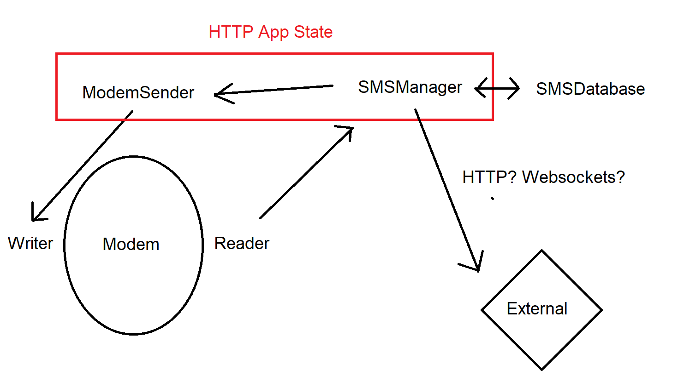

# TODO

Fork the huawei modem lib, remove everything except for the PDU stuff and encoders.
Make it so the delivery status can actually be enabled directly within the constructor.

## ModemSender

This should remain as generic as possible, only sending requests (and basic SMS payloads)
through the command channel. It should be called by the HTTP state only.

## SMSManager

This should coordinate the DatabaseConnection and the incoming unsolicited messages channel.
Sent SMS messages should be stored in database, and it should update delivery statuses etc.
It should also handle dispatching the update HTTP requests to end web-service.

# Design

